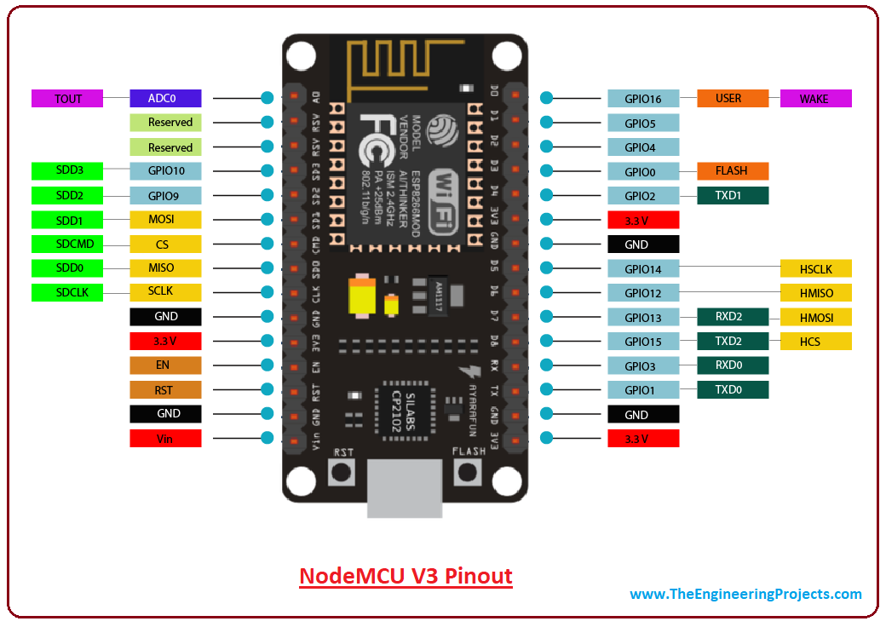

# PWM Servo Control Example  

* This example shows how to use PWM module to control a SG90 Servo peripheral, based on the [Espressif ESP8266 RTOS SDK PWM Example](https://github.com/espressif/ESP8266_RTOS_SDK/tree/master/examples/peripherals/pwm)

<br/>

## Code Overview
* This example uses the Espressif [ESP8266 RTOS SDK](https://github.com/espressif/ESP8266_RTOS_SDK) based on FreeRTOS
* The example code is located in `main/pwm_example_main.c`
* The example uses the provided PWM driver to control a SG90 servo in a continuous loop
* More information about PWM servo control: [Servo Control](https://en.wikipedia.org/wiki/Servo_control)
* More information about PWM: [Pulse Width Modulation](https://en.wikipedia.org/wiki/Pulse-width_modulation) 

### SDK Pin assignment  
    * GPIO2 is assigned as the PWM channel 0. 

## Setup 

### Hardware Required  
* ESP8266 Board Configuration:

  

* Connection:  
  * Connect D4 pin (GPIO2) to Servo control wire
  * Connect 3V pin to Servo positive wire
  * Connect G pin to Servo ground wire 

### Project Configuration
* Follow the [Getting Started Guide](https://docs.espressif.com/projects/esp8266-rtos-sdk/en/latest/get-started/index.html) to setup your development environment and build toolchain

* Setup the serial port setting in the project configuration:

  * ``` $> make menuconfig ```


### Build and Flash  

* Build the project and flash it to the board, then run monitor tool to view the serial output:

  * ``` $> make -j4 flash monitor ```

* To exit the serial monitor, type ``Ctrl-]``.


